## Introduction

Under the scope of EPFL's ADA class project, we will perform a creative extension on the paper Linguistic Harbingers of Betrayal. In this project we will work on the subject of Natural Language Processing (NLP) and more specially on Linguistic cues. As we will present to you in the next section, the authors of the paper worked on the messages of the diplomacy game and extracted some features to do some analysis and then train a simple model to perform a complex task, even for humans, which is detecting betrayal. To extend this work we will first try to train more complex and adapted models for this kind of tasks, like RNNs to see how they perform and draw some conclusions from the results. Then we will extend this work to another and completely different dataset, a dataset of news. The goal is to try and see if the same features can be used for various NLP examples.
 
## Related Work: The Linguistic Harbingers of Betrayal paper 

Since our work consists on a creative extension for the Linguistic Harbingers of Betrayal paper, we will describe briefly the work done by the authors to put you in the contest.    
The authors worked on the diplomacy game, which is a war-themed strategy game where friendships and betrayals are orchestrated primarily through language. They collected a dataset, that contains 500 games half of them for games that end with an attack and the other half for games without attacks. Each game contains multiple seasons, and in each season the players communicate via messages then perform and action simultaneously. The two sets are matched to get the most accurate results.   They consider an attacker the first player that breaks the friendship. For games without an attack, the attacker is chosen randomly from the two players.   They performed some preprocessing to extract the following features from the messages: sentiments (negative, positive, neutral), politeness, talkativeness, discourse markers (planning, comparison, expansion, contingency, subjectivity, premises, claims). After extracting these features, they generated some plots to see and compare the behaviours of those between the two types of players. After some analysis, they fed these features to a Logistic regression model that achieved a 57% cross-validation accuracy at detecting betrayals.   They concluded that the classifier is able to exploit subtle linguistic signals that surface in the conversation. They also analysed how these features evolve as we get closer to betrayal to detect imbalances and check how effective are the features at detecting long-term betrayals. 

## Data collection  
As we described in the Introduction, our project consists on two parts each of them working on a diffrent dataset. 

### Diplomcay dataset
The first dataset is the Diplomacy game dataset that was provided with the paper. It conatins 500 games, each game is a dictionnary with 5 entries:
* **seasons**: a list of the game seasons
* **game**: unique identifier of the game it comes from 
* **betrayal**: a boolean indicating if the relationship ended in betrayal or not 
* **idx**: unique identifier of the dataset entry  
* **people**: the countries played by the players   

The season entry is a dictionnary with 3 entries:
* **season**: a year that gives you a notion of order within the seasons
* **iteraction**: a dictionnary that indicates what actions did the betrayer and victim do to each other respectively. Actions available could be either attack, support or None.
* **messages**: contains all the features that the authors of the "Linguistic harbringers of betrayal" rely on to analyze the messages.  
  
The features are the following: 
* **sentiment**: it contains the values for the positive, negative and neutral sentiments
* **lexicon_words**: contains multpiple entries:  
&emsp; **allsubj**: words to compute the subjectivity feature  
&emsp; **premise**: words to compute the premise feature  
&emsp; **claim**: words to compute the claim feature  
&emsp; **disc_expansion**: words to compute the expansion feature  
&emsp; **disc_comparison**: words to compute the comparison feature  
&emsp; **disc_temporal_future**: words to compute the planning feature  
&emsp; **disc_temporal_rest**: words to compute the temporal feature  
&emsp; **disc_contingency**: words to compute the contingency feature    
* **n_requests**: contains the number of requests  
* **frequent_words**: the frequent words
* **n_word**': contains the number of words 
* **politeness**: containss the politeness of the message
* **n_sentences**: contains the number of sentences

According to paper, the talkativeness is quantified with the number of messages sent, the average number of sentences per message, and the average number of words 
per sentence.

### Real and fake news dataset 
The second dataset is the Fake and real news dataset (https://www.kaggle.com/clmentbisaillon/fake-and-real-news-dataset).  

This dataset contains two sets, a set of real news and another one of fake news. Both sets contain the same features, which are: 
* **text**: The actual text of the news article. 
* **title**: The title of the article.
* **subject**: Every article is classified in a type of subject either 'Government News' or 'Middle-east' or 'News' or 'US_News' or 'left-news' or 'politics' or 'politicsNews' or 'worldnews'.
*  **date**: date of publication of the article.


The  truthful  articles  were  obtained by  crawling  articles  from  Reuters.com  (News website).  As  for  the  fake  news  articles,  they  were  collected  from  different  sources.  The  fake  news articles  were  collected  from  unreliable  websites  that  were  flagged  by  Politifact  (a fact-checking organization in the USA) and Wikipedia. The dataset contains different types of articles on different topics, however,the majority of articles focuson political and World news topics.

# Diplomacy Game:
The first part of our project consists on running an RNN model on the features extracted by the authors and test it's performance. The goal of our analysis here is to see if analysis using time series can help improve the performance of the model made by the authors.  

To make our model comparable to that of the author's we try to use the same dataset and same conventions they used.

The whole point of RNN is to see if the variation of the features between the seasons has an effect on our predictive power. For example, the evolution of politeness between seasons can be quite meaningful, in fact we notice from this plot of the authors the imbalance in the politeness of the players as we get closer to betrayal.

(plot el betrayal houni) 

As a first step, we extracted the average value per season for each of the features for the victims and betrayers in betrayal games. We created a dataframe containing all the features along with a label to distinguish the two players. We normalized the dataset using the z-score.

Not all games have the same number of seasons, and since the RNN model requires inputs (in our case the games) of the same size, we will padd the games with empty seasons to have all games with the same length, which is the length of the longest game in our dataset. Now all the games have 10 seasons.

**RNN architecture**  
Our RNN model is built as follows:
*  A first RNN layer with 10 time steps each taking a 16 dimension vector and outputting a 4 dimension vector 
*  A sigmoid layer (equivalent to logistic regression) to output the prediction, regularized by elsatic net
*  We compile the model using the MSE loss function, the adam optimizer and the accuracy as a metric.
*  we define an early stopping to stop training the accuracy metric has stopped improving.

We used 90% of the data for training and 10% for testing. The model reached an Accuracy of **0.67** on the validation set and an Accuracy of **0.45** on the test set. 

We show here the evolution of the binary accuracy and loss per epoch.


<p align="center">
      
</p>


We also decided to tested our model on non-betrayal games to see how well it performs at detecting the non intention of betrayal. We preprocessed the non-betrayal dataset the same way as we did the the betrayal one and then we evaluated the model on it. The model reached an Accuracy of  on this test set. 

**Conclusion**
We want to perform more exhaustive NLP analysis with a larger dataset, to see if the NLP analysis model proposed by the authors and extended by our work generalizes well to other analogous cases.   

Thus we will now move to our new dataset to explore the effect of the linguistic cues on detecting True and Fake news.  

# True and Fake news:
In this second part of our project we will deal with the True and Fake news dataset, we present to you here the diffrent steps that we performed.  
## Preprocessing 
The news datasets requires some preprecessing  before  the analysis.  In  fact,  the  news  contain  a  lot  of  links,  tags ... that are useless for the linguistic cues analysis thus we delete them.  We  also  map  all  the  news  to  lower  case  letters  to avoid miss-leading the models. We also perform some specific modifications  to  remove  empty  strings,  multiple  spaces...  to ensure  that  we  have  proper  entries  both  for  the  analysis  and the models.
 

## Extracting features
### Sentiments
***coreNLP***

The goal was to reproduce the same sentiment analysis as the ones done in the paper. The authors relied on the Stanford sentiment analyser for this task. In the first part of this task we implemented methods to compute the sentiments using the Stanford coreNLP, however these computations appeared to be very time consuming ( it will take more than 2 days for the Fake news dataset only), and since we have very limited time and also limited hardware resources, we decided to limit these calculations to a subset of the datasets to see their behaviour on average.  
The coreNLP sentiment analyser computes the sentiment based on how words compose the meaning of longer phrases and not on words independently. We computed the sentiments of each sentence using it and then took the average of the sentences sentiments to get the sentiments of a given news. This was performed on 3000 Real and Fake news respectively. Since the news are independent, (we estimate that 3000 is quite representative sample of the entire dataset). 
We show here average number of Sentiments with coreNLP for 3000 Fake and Real news resepectively:

<p align="center">
     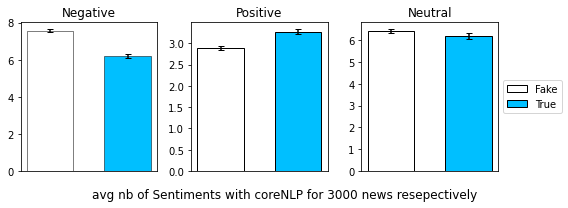 
</p>

The Fake news have on average more negative sentiments but less positive sentiments than the True news for the samples that we considered. However the number of neutral sentiments seems to be close for both types. We performed a statistical test to compare the mean values for the neutral sentiments and we found that diffrence between the two types and we didn't find a significant p_value thus we cannot conclude on the diffrence.

***TextBlob***  

After some researches, we found that other methods exist to perform sentiment analysis, but they are usually considered less efficient than the Stanford methods, which explains the choice of the authors. This alternative method is part of the TextBlob library that allows to compute the polarity of a text. This last, is much less time consuming, thus we were able to compute the polarity of the entire dataset. However note that while the Stanford analyser computes the number of sentiments (very negative, negative, neutral, positive, very positive) on each sentence, the TextBlob method computes the polarity, which is the overall sentiment, on an entire text and returns a value in the interval [-1, 1] where values under zero represent negative sentiments, values above zero represent positive sentiments and zero is the neutral sentiment.  

After computing the polarity of each news, we split the range [-1, 1] into 5 bins to get the sets of sentiments as we had with the Stanford coreNLP. We present here the number of news by sentiment category

<p align="center">
     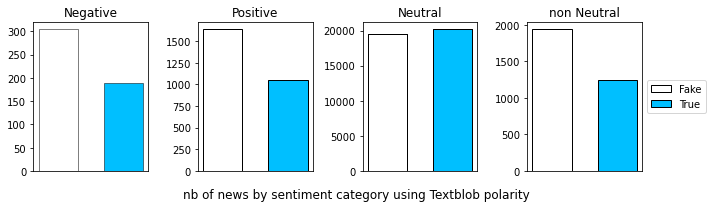 
</p>

There are more positive and negative news (considering overall sentiment of the news, the polarity!) among the Fake news then among the True news. The fourth plot confirms that the Fake news are more sentimental than the True news that tend to be more neutral.

**Interpretation**
As mentioned above, Real news come from crawler went through reuters' website, thus as expected from this type of news aims for high level journalism which implies passing on news in the most authentic thus neutral way. This can be seen in the lack of sentiments and higher neutrality in Real news compared to the Fake ones as we saw in the plots. On the other han Fake news articles were collected from unreliable websites or personal tweets thus they are more likely to be oppinionated or more likely to have a populist tone of voice which is usually discouraged in news articles that should be factual and nutral. The problem of populist articles is that readers can often get distracted by the emotion of the article and skip the verification. 


### Politeness  

To compute the politeness of each news, we used the politeness library which is a part of the Stanford Politeness API that was used by the authors. The politeness classifier takes as input a sentence and its parses and returns the politeness of that sentence. The politeness of a news is computed as the average of its sentences politenesses. To compute the parses, we first relied on the annotate method of the Stanford coreNLP that is computed while computing the sentiments, but as we were forced to stop this method at a certain point and we had to switch to another method to compute the remaining parses. For this we used TextBlob library that computes the parses in the same way.  
We show here the average politeness for the Fake vs True news:

<p align="center">
     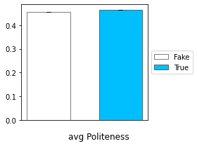 
</p>

The average politeness of the Fake and True news are very close. We performed a statistical test and found that the diffrence between the mean politeness of the Fake and Real news is significant.  
We visualize here the distribution of the politeness for the two sets.

(image)
**Interpretation**
The small diffrence between the politeness of the True and Fake news, can be due to the fact that Fake news like in tweets can sometimes get personal and thus less polite.

### Talkativeness 
We computed the talkativeness of each news, which consists on the number of sentences and the number of words per news. Here also we started with the CoreNLP annotate method then switched to other methods form the NLTK library. 
We show here the average talkativeness for the Fake vs True news:

<p align="center">
     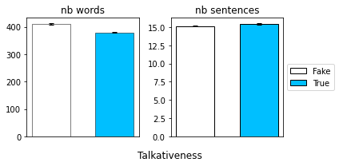 
</p>

There is a significant diffrence in the average number of words between the two sets, with the Fake news have a higher value on average with a very small std. However, for the number of sentences, we can see from the plot that the average values are very close. We performed a statistical test on the number of sentences and found that the p_value is not significant thus we cannot conclude on the diffrence.


### Discourse connectors
We weren't able to reproduce the same work done by the authors to extract the discourse connectors due to the lack of information. Thus we made our researches on the internet to either find predefined methods that do the task or collect the different markers for the feature and compute the number of their occurrences in the news.
* **Subjectivity**  
for  the  subjectivity  we  used a predefined method from TextBlob library that computes it for a given text. It returns a float in the range [0.0,  1.0]  where  0.0  is  very  objective  and  1.0  is  very subjective.
we show here the results we got for the average subjectivity for the Fake and Real news:

<p align="center">
     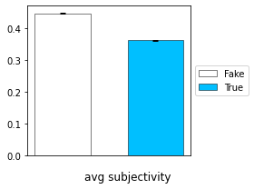 
</p>


**Interpretation**

The Fake news are on average more subjective than the True news. This is explained by the fact that subjectivity variates inversly to neutrality, thus in Fake news we have given the populist tone we tend to use strong words like 'resounding' and 'astonishing'.


* **Expansion, contingency and comparison**  
For these features, no predefined method was found. Thus we collected markers from the internet for each of them and combined them with the features that we extracted from the diplomacy dataset, to get the complete set of markers.
we show here the results we got for the average values of the expansion, contingency and comparison features for the Fake and Real news:

<p align="center">
     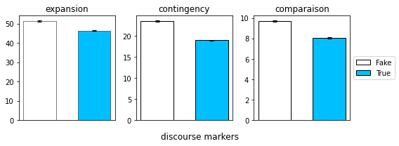 
</p>

On avergae Fake news contain more expansion, contingency and comparaison discourse connectors than the True news. This shows that True news are less eloquant than Fake news. Short setences strait to the point are factual wheras long sentences that compose fake news need more discourse connectors. 


* **Premises and conclusions**  
There was no predefined method for this feature as weel. We collected the markers from the internet and combined them with the features that we extracted from the diplomacy dataset, to get the complete set of markers.  

<p align="center">
     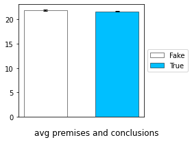 
</p>

the average number of premises and conclusions for the Fake and True sets are close. We performd a statistical test and found a non significant p_value thus we cannot conclude about the diffrence.

## Classification with MLP (Multi-Layer Perceptron)
After extracting and analysing these features, we built a MLP model that classifies the Fake and True news using them. The objective here is to verify if the "Linguistic harbringers of betrayal" model generalizes to other datasets. We only retain the features that have been computed for all the dataset and that have been used by the author for homogenity to train our model. We thus used only the following features: **nb_sentences**,	**nb_words**,	**politeness**,	**premises_conclusions**,	**subjectivity**,	**polarity**,	**comparaison**,	**contingency**	and **expansion.** To train the model we gave labels to distinguish the two datasets, 1 for the True news and zero for the Fake news. We normalized the data with the z_score scaling and we split it randomly into 80% of train set and 20% of test set.   

**Model architecture:**  
We build a model with:  
* 16 neurones as input layer   
* 256 neurones for the first hidden layer  
* 64 neurones for the second hidden layer  
* 1 neurone for the last layer that is going to provide the output  
* We add early stopping and L2 regularization to avoid overfitting    

The model achived an Accuracy of **0.826** on the test set.    

We present here the precison_recall curve of our model: 

<p align="center">
      
</p>

The Precision-Recall curves summarize the trade-off between the true positive rate and the positive predictive value for a predictive model using different probability thresholds. We see that the model performs well as we got an average precison of 87% and it has a considerable AUC (Area Under the Curve).


As we can see the model performs pretty well with those features, which means that they generalize well for these kinds of analogous NLP classification problems. From the performance of this modle we can conclude that these features are strongly correlated to wether news are Fake or not. However, we ask ourselves this question, are they really directly linked to the problem or simply just correlated? (CHGAABHA!!!!!!!!!!!!!!!!!!!!!!!!!)

To answer this question and to extend our research even more, we will now train new models on the 'text' of the two datasets using standard deep learning and NLP techniques. The goal here is to give the model the freedom of learning its own features and then compare them with the ones of the authors and how good they are at classfying news.

## Textual analysis
### Visualization
We started by visualizing some textual properties of our dataset to get some insights.

Here we see the wordclouds that we generated for all the news:

<p align="center">
  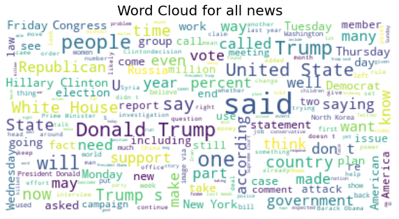
</p>

And here we plot the top 10 n_grams of sizes 1, 2 and 3: 

<p align="center">
      
</p>


We can see through these plots that 'said' is one of the most common words in both datasets, thus the dataset is comprised of a lot of quotes or hearsay about various eminent political figures (Trump, Obama, Clinton, rex tillerson ...) and their political parties (Republican or Democrat). The dataset also quotes various infamous news sources (Fox news, New York Times, ...). We see also a lot of recently trending topics in the world like "Black lives matter". 
Central hubs of power are (New York , North Korea, the White House) are also mentionned all the way throughout the news. 
Thus the lingo is mostly based on US political news (internal or external).


After these visualizations, we developed two models to classify our data. The first is an MLP model combined with TF-IDF while the second is a more complex one, an RNN model. We describe in the following sections these two models an their results.

### Classification with MLP (Multi-Layer Perceptron)
To approach this classification problem we first want to create a vector space for our documents.
We opt for the usage of TF-IDF vectorizer to map our documents to vectors who have as features, the TF-IDF value of the most common set of words in the different news articles (2860 words which are the words that present in at least 1% of the documents). 
The choice of an MLP came naturally as it's extremely perfomant to approximate complex multivariate mappings in higher dimensional spaces.
Before training, we normalized the datasets using the l2 norm. We then split the data randomly into 75% of train set and 25% of test set.

**Model architecture:**  
We build a model with:  
* 2860 neurones as input layer   
* 300 neurones for the first hidden layer  
* 100 neurones for the second hidden layer  
* 50 neurones for the third hidden layer 
* 1 neurone for the last layer that is going to provide the output  
* We add early stopping and L2 regularization to avoid overfitting  

The model gave an Accuracy of **0.985**, on the test set. 

We present here the precison_recall curve of our model:    

<p align="center">
     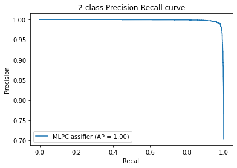 
</p>

We see that the model performs extremely well as we got an average precison of 100% and it has an almost perfect AUC (Area Under the Curve).  

Here we analyze how the MLP classifies the news.  
We inspect the subjectivity of the words having a higher likelihood of classified as Fake or True respectively.  

<p align="center">
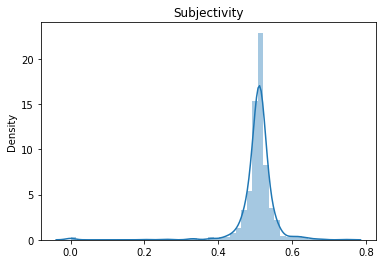                 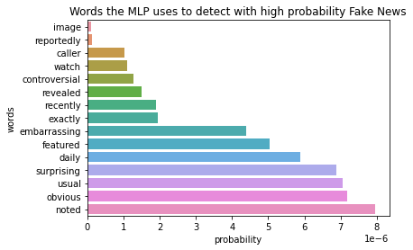  
</p>

<p align="center">
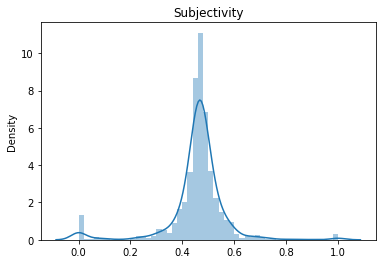                  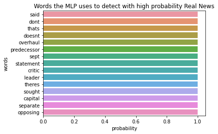
</p>

We can clearly see that the words with a higher likelihood to be classified as Fake have signifiacntly higher subjectivity (p-value = . The model implicitly picks up on the subjectivity feature which justifies its relevance in the previous analysis. 
 TODOOOOOOOOOOOOOOOOOO


**But !**  
The MLP model learned through training words that are the most common on each dataset and uses them to classify the new news it gets. Thus if we compose a sentence containing some of the most common words of the Fake dataset we are almost sure that the model wil classify it as Fake. The MLP classifier, thus has a bias towards certain words being used in this context. This is something that the previous analysis (with sentiments) clearly doesn't have a bias towards these words because it operates at a certain level of abstraction above: only the feeling that comes out of the sentence in general is taken into account. 

 ```bash
 print("probability of classifying the sentence trump said as true is: ", clf.predict_proba(vectorizer.transform(["Trump said that the WAP group is the best"]))[0][1])
 
 ```
 
 probability of classifying the sentence trump said as true is: 0.8365605057544774


### RNN (Recurrent Neural Network)
The MLP with the TF_IDF model is that it doesn't take into account the structure of the text, its length or the order of the words in that text. This can be an important feature in texts especially in the english language that is very sensitive to the order of the words in a sentence. (For example, Has Nizar been to the barber is 
Thus, if we want to take it into account we should change the way we approach this problem. A text can be seen as a series of words, thus an RNN (a perfectly fitted model for time series) can be good to classify this text seen as a time series of words.

Not all texts have the same length, and since the RNN model requires inputs of the same size, we will padd the text and we set them all to a length of 270 words.

We implemented an RNN model using LSTM layers. LSTM (long short term memory) and because sequences are kind off long (270 times steps !) thus we need the forget gate to be able to remember far away but previously  seen inputs and its decisions are influenced by what it has learnt from the previous time steps, that's what makes RNNs more powerful than the other models for this kind of classification. We split the data randomly into 75% of train set and 25% of test set.


### Embeddings

-- Explain embeddings

To note how important the embeddings are the model initially run without them only reached 82% accuracy and 70% F1 score on the training set with very slow convergence (after 100 epochs, which was almost 1 hour of running with the google COLAB GPU). However stay tuned to see what is the effect of adding an embedding layer to the model :smiley:


**Model architecture:**  
We build a model with:  
* embedding layer (see next section) that takes an input a 270 entries vector and outputs a 270 time steps each with a vector of size 50
* bidirectional LSTM layer that outputs a vector of size 64 
* dense layer of 64 neurons  
* dropout layer of 0.2  
* 1 neurone for the last layer that is going to provide the output  
* We add early stopping, Learning rate reducer and Elastic net regularization to avoid overfitting  

The model gave an accuracy of **0.996** on the test set. **0.997** also of F1, recall and precision !

-- INSERT GRAPH

The model performs extremely well with very fast convergence (on average less than 10 epochs) as seen in the graph.

We also check if the problem has the prevoiously mentionned bias to words highly associated to fake news.

```bash
sad_us = pad_sequences(tokenizer.texts_to_sequences(["Trump said that the WAP group is the best"]), maxlen = 270, padding='post', truncating='post')
print("probability of classifying the sentence trump said as true is: ", model.predict(sad_us)[0][0])
```
probability of classifying the sentence trump said as true is:  0.0047642803 :cry:  
**conclusion**


## Conclusion
As we saw through our project, the features that the authors used to detect betrayal in the diplomacy game generalize pretty well to a completely diffrent dataset which is the Fake and True news. We also ran two diffrent models, an MLP model and a RNN model on the texts of our second dataset and got good results. However, these trained models do not generalize well when they will be tested on other sets of news like for example news from the middle-East. This is due to the fact that these models learned word specific features from the training sets and those features do not work well with new diffrent sets. However the features that the author use generalize better, because they are not specific to some type of datasets, and our project is a proof of this fact. 
      
  
      
           
