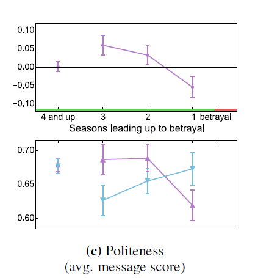
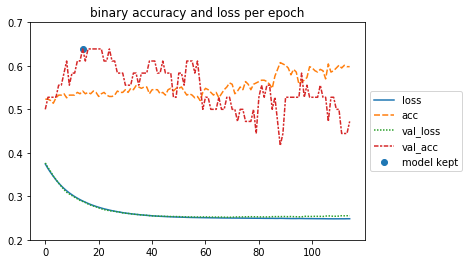
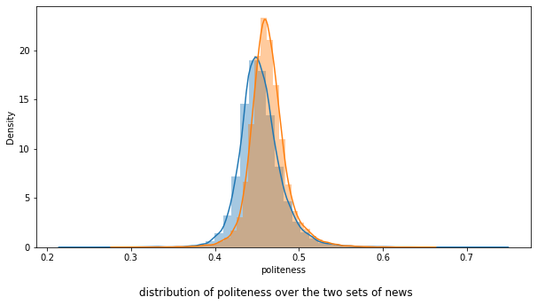
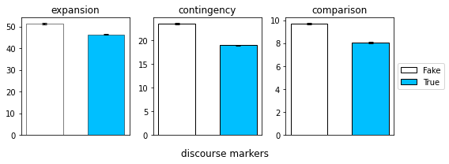

## Introduction

Under the scope of EPFL's ADA's class project, we will perform a creative extension on the paper "Linguistic Harbingers of Betrayal". In this project we will work on Natural Language Processing (NLP) and more particularly on linguistic cues. As will be presented in the next section, the authors of the paper used messages exchanged between players of the online game "Diplomacy" and extracted some features to do some analysis. They trained a simple model to perform a complex task, even for humans, which is to predict an imminent betrayal. In order to extend this work we will, first, try to train more complex and adapted models for these sort of tasks: RNNs. Once we have trained our RNNs we will see how our model performs and draw some conclusions. Then, we will extend our work to another and completely different dataset: a dataset of news. Our goal is to try and see if the same features can be used for various NLP examples.
 
## Related Work: The Linguistic Harbingers of Betrayal paper 

Since our work consists of a creative extension of the "Linguistic Harbingers of Betrayal" paper, we will begin by briefly describing the work done by the authors.

The authors worked on the game Diplomacy, which is a war-themed strategy game where alliances and betrayals are orchestrated primarily through language. They used a dataset, that contains 500 games: half of them ended with in betrayal and the other half did not. Each game contains multiple seasons, and in each season the players communicate via messages and act simultaneously. The two sets are matched to get the most accurate results.   They consider as an attacker the first player that breaks the friendship. For games without an attack, the attacker is chosen randomly from the two players.   They performed some preprocessing to extract the following features from the messages: sentiments (negative, positive, neutral), politeness, talkativeness, discourse markers (planning, comparison, expansion, contingency, subjectivity, premises, claims). After extracting these features, they generated some plots to compare the behavior between the two types of players. After some analysis, they input these features into Logistic regression model that achieved a 57% cross-validation accuracy at detecting betrayals.   They concluded that the classifier can exploit subtle linguistic signals that surface in conversation. They also analyzed how these features evolve as we get closer to the moment of betrayal, to detect imbalances and check how effective the chosen features are at detecting long-term betrayals. 

## Data collection  
As we described in the Introduction, our project consists of two parts each of them working on a different dataset. 

### Diplomacy dataset
The first dataset is the Diplomacy game dataset that was provided with the paper. It contains 500 games, each game is a dictionary with 5 entries:
* *seasons*: a list of the game's seasons.
* *game*: a unique identifier of the game it comes from. 
* *betrayal*: a Boolean indicating if the relationship ended in betrayal or not.  
* *idx*: a unique identifier of the dataset entry.  
* *people*: the countries played by the players.   

The season entry is a dictionary with 3 entries:
* *season*: a year that gives you a notion of order within the seasons.
* *interaction*: a dictionary that indicates what actions did the betrayer and victim do to each other respectively. Actions available could be either attack, support or None.
* *messages*: contains all the features that the authors of the "Linguistic harbingers of betrayal" rely on to analyze the messages.  

The features are the following: 
* *sentiment*: it contains the values for the positive, negative and neutral sentiments.
* *lexicon_words*: contains multiple entries:  
&emsp; *allsubj*: words to compute the subjectivity feature.  
&emsp; *premise*: words to compute the premise feature.  
&emsp; *claim*: words to compute the claim feature.  
&emsp; *disc_expansion*: words to compute the expansion feature.  
&emsp; *disc_comparison*: words to compute the comparison feature.  
&emsp; *disc_temporal_future*: words to compute the planning feature.  
&emsp; *disc_temporal_rest*: words to compute the temporal feature.  
&emsp; *disc_contingency*: words to compute the contingency feature.    
* *n_requests*: contains the number of requests.  
* *frequent_words*: the frequent words.
* *n_word*': contains the number of words.
* *politeness*: contains the politeness of the message.
* *n_sentences*: contains the number of sentences.

According to the paper, the talkativeness is quantified with the number of messages sent, the average number of sentences per message, and the average number of words 
per sentence.

### Real and Fake News dataset 
The second dataset is the Fake and real news dataset (https://www.kaggle.com/clmentbisaillon/fake-and-real-news-dataset).  

This dataset contains two sets, a set of Real News and another one of Fake News. Both sets contain the same features, which are: 
* *text*: The actual text of the news article. 
* *title*: The title of the article.
* *subject*: Every article is classified in a type of subject either 'Government News' or 'Middle-east' or 'News' or 'US_News' or 'left-news' or 'politics' or 'politicsNews' or 'worldnews'.
*  *date*: publishing date of the article.


The truthful articles were  obtained by crawling articles from  Reuters.com  (News website). As for the  Fake  News  articles, they  were  collected  from  different  sources.  The Fake News articles  were  collected  from  unreliable  websites  that  were  flagged  by  PolitiFact  (a fact-checking organization in the USA) and Wikipedia. The dataset contains different types of articles on different topics, however, the majority of articles focus on political and World news topics.

# Diplomacy Game:
The first part of our project consists of running an RNN model on the features extracted by the authors and test its performance. Our goal is to see if using time series can  improve the performance of the aurhtor's model.  

To make our model comparable to that of the authors, we tried to use the same dataset and the same conventions they used.

The goal of this RNN is to see if a fluctuation in any given feature between seasons has an effect on our predictive power. For example, the evolution of politeness between seasons can be quite meaningful. In fact, we notice from the authors' plot the imbalance in the politeness between the players as we get closer to betrayal.

<p align="center">
      
</p>

As a first step, we extracted the average value per season for each of the features for the victims and betrayers in betrayal games. We created a dataframe containing all the features along with a label to distinguish the two players. We normalized the dataset using the z-score.

Not all games have the same number of seasons, and since the RNN model requires inputs (i.e. games) of the same size, we will pad the games with empty seasons to have all games with the same length, which is the length of the longest game in our dataset. Now all the games have 10 seasons.

*RNN architecture*  
Our RNN model is built as follows:
*  A first simple RNN layer with 10 time steps each taking a 16 dimensions vector and outputting a 4 dimensions vector.
*  A sigmoid layer (equivalent to a logistic regression) to output the prediction, regularized by elastic net.
*  We compile the model using the MSE loss function, the Adam optimizer and the accuracy as a metric.
*  We define an early stopping to stop training if the accuracy metric has stopped improving.

We used 90% of the data for training and 10% for testing.

We show here the evolution of the binary accuracy and loss per epoch.


<p align="center">
      
</p>

The model reached an Accuracy of *0.64* on the validation set and an accuracy of *0.55* on the test set. Which is an improvement compared to the authors' results who only got a *0.57* cross-validation accuracy on the validation set. We also decided to test our model on non-betrayal games to see how well it performs at detecting the non-intention of betrayal. We preprocessed the non-betrayal dataset the same way as we did with the betrayal one and then we evaluated the model on it. The model reached an Accuracy of *0.58* on this test set.  Thus, harnessing the time evolution of the features can be helpful to the model.  

However, the model has a lot of trouble converging. We don't have a lot of data, thus, to reach convergence we simplify the model as much as we can, we add batch normalization, and regularize quite heavily (high L2 values, early stopping ...). Yet the problem remains complex, the simple model cannot fully grasp the decision boundary between betrayal or not for a given time series.

*Conclusion*  
We want to perform more exhaustive NLP analysis with a larger dataset, to see if the NLP analysis model proposed by the authors and extended by our work generalizes well to other analogous cases.   

Thus, we will now move to our new dataset to explore the effect of the linguistic cues on detecting True and Fake news.  

# True and Fake news:
In this second part of our project, we will deal with the True and Fake news dataset, we present to you here the different steps that we performed.  
## Preprocessing 
The news datasets requires some preprocessing before  the analysis.  In  fact,  the  news  contain  a  lot  of  links,  tags ... that are useless for the linguistic cues analysis thus we delete them.  We  also  map  all  the  news  to  lower  case  letters  to avoid miss-leading the models. We perform some specific modifications to  remove  empty  strings,  multiple  spaces...  to ensure that  we  have  proper  entries  both  for  the  analysis  and the models.
 

## Extracting features
### Sentiments
**coreNLP**

The goal was to reproduce the same sentiment analysis as the ones done in the paper. The authors relied on the Stanford sentiment analyzer for this task. In the first part of this task we implemented methods to compute the sentiments using the Stanford coreNLP. However, these computations appeared to be very time consuming ( it will take more than 2 days for the Fake news dataset only), and since we have very limited time and also limited hardware resources, we decided to limit these calculations to a subset of the datasets to see their behavior on average.  
The coreNLP sentiment analyzer computes the sentiments based on how words compose the meaning of longer phrases and not on words independently. We computed the sentiments of each sentence using it and then took the average of the sentences sentiments to get the sentiments of a given news. This was performed on 3000 Real and Fake news respectively. Since the news are independent, (we estimate that 3000 is quite representative sample of the entire dataset). 
We show here the average number of Sentiments with coreNLP for 3000 Fake and Real news respectively:

<p align="center">
      
</p>

The Fake news have on average more negative sentiments but less positive sentiments than the True news for the samples that we considered. However the number of neutral sentiments seems to be close for both types. The standrad deviations are very small. We performed a statistical test to compare the mean values for the neutral sentiments but we didn't find a significant p_value thus we cannot conclude on the difference.

**TextBlob**  

After some research, we found that other methods exist to perform sentiment analysis, but they are usually considered less efficient than the Stanford methods, which explains the choice by the authors. This alternative method is part of the TextBlob library that allows to compute the polarity of a text. This last method, is much less time consuming, thus, we were able to compute the polarity of the entire dataset. However! note that while the Stanford analyzer computes the number of sentiments (very negative, negative, neutral, positive, very positive) on each sentence, the TextBlob method computes the polarity, which is the overall sentiment, on an entire text and returns a value in the interval [-1, 1] where values under zero represent negative sentiments, values above zero represent positive sentiments and zero is the neutral sentiment.  

After computing the polarity of each news, we split the range [-1, 1] into 5 bins to get the sets of sentiments as we had with the Stanford coreNLP. We present here the number of news by sentiment category

<p align="center">
      
</p>

There are more positive and negative news (considering the overall sentiment of a news, the polarity!) among the Fake news then among the True news. The fourth plot confirms that the Fake news are more sentimental than the True news that tend to be more neutral.

*Interpretation*  
As mentioned above, Real news come from a crawler that went through Reuters’ website; thus, as expected, this type of news aim for high level journalism which implies passing on news in the most authentic (i.e. neutral) way. This is explained by the lack of sentiments and higher neutrality in Real news compared to the Fake ones as we saw in the plots. On the other hand, Fake news articles were collected from unreliable websites or personal tweets: they are more likely to be opinionated or to have a populist tone of voice which is usually discouraged in news articles that should be factual and neutral. The problem of populist articles is that readers can often get distracted by the emotion of the article and skip the verification. 


### Politeness  

To compute the politeness of each news, we used the politeness library which is part of the Stanford Politeness API that was used by the authors. The politeness classifier takes as input a sentence and its parses, and returns the politeness of that sentence. The politeness of a news is computed as the average of its sentences politeness’.   To compute the parses, we first relied on the annotate method of the Stanford coreNLP that is computed while computing the sentiments, but as we were forced to stop this method at a certain point, we had to switch to another method to compute the remaining parses. For this, we used the TextBlob library that computes the parses in the same way.  
We show here the average politeness for the Fake vs True news:

<p align="center">
      
</p>

The average politeness of the Fake and True news are very close and the std is very small. We performed a statistical test and found that the difference between the mean politeness of the Fake and Real news is significant.  

We visualize here the distribution of the politeness for the two sets.

<p align="center">
      
</p>

*Interpretation*  
The small difference between the politeness of the True and Fake news, can be due to the fact that Fake news, like in tweets, can sometimes get personal and thus less polite.

### Talkativeness 
We computed the talkativeness of each news, which consists of the number of sentences and the number of words per news. Here also we started with the CoreNLP annotate method then switched to other methods from the NLTK library. 
We show here the average talkativeness for the Fake vs True news:

<p align="center">
      
</p>

There is a significant difference in the average number of words between the two sets, with the Fake news having a higher value on average with a very small std for both sets. However, for the number of sentences, we can see from the plot that the average values are very close. We performed a statistical test on the number of sentences and found that the p_value is not significant thus we cannot conclude on the difference.


### Discourse connectors
We were not able to reproduce the same results as the authors to extract the discourse connectors due to the lack of information. We made tried to find on the internet other predefined methods that do the task or collect the different markers for the feature and compute their number of occurrences in the news.
* *Subjectivity*  
For the  subjectivity  we  used a predefined method from the TextBlob library that computes it for a given text. It returns a float in the range [0.0,  1.0]  where  0.0  is  very  objective  and  1.0  is  very subjective.
We show here the results we got for the average subjectivity for the Fake and Real news:

<p align="center">
      
</p>


*Interpretation*  
Fake news are on average more subjective than True news, with a small std. This can be explained by the fact that subjectivity is inversely proportional to neutrality. For example, Fake news, given their populist tone, tend to use strong words like 'resounding' and 'astonishing'.


* *Expansion, contingency and comparison*  
For these features, no predefined method was found. We collected markers from the internet for each of them and combined them with the features that we extracted from the Diplomacy dataset to get the most complete set of markers.
We show here the results we got for the average values of the expansion, contingency and comparison features for the Fake and Real news:

<p align="center">
      
</p>

On average, Fake news contain more expansion, contingency and comparison discourse connectors than the True news, with small standard deviations. This shows that True news are less eloquent than Fake news. Short sentences straight to the point are factual whereas long sentences that compose Fake news need more discourse connectors. 


* *Premises and conclusions*  
There was no predefined method for this feature either. We collected the markers from the internet and combined them with the features that we extracted from the Diplomacy dataset, to get the complete set of markers.  

<p align="center">
      
</p>

the average number of premises and conclusions for the Fake and True sets are close, with small std. We performed a statistical test and found a non-significant p_value: we cannot conclude about the difference.## Conclusion


```markdown
Syntax highlighted code block
   
# Header 1
## Header 2
### Header 3

- Bulleted
- List

1. Numbered
2. List

**Bold** and _Italic_ and `Code` text

[Link](url) and 
```

For more details see [GitHub Flavored Markdown](https://guides.github.com/features/mastering-markdown/).

### Jekyll Themes

Your Pages site will use the layout and styles from the Jekyll theme you have selected in your [repository settings](https://github.com/zeineb111/data_story_WAP/settings). The name of this theme is saved in the Jekyll `_config.yml` configuration file.

### Support or Contact

Having trouble with Pages? Check out our [documentation](https://docs.github.com/categories/github-pages-basics/) or [contact support](https://github.com/contact) and we’ll help you sort it out.
